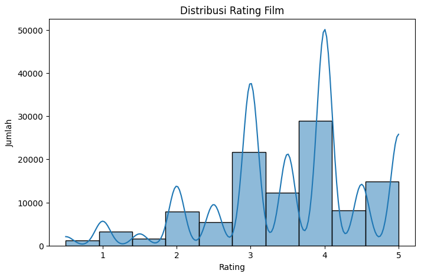
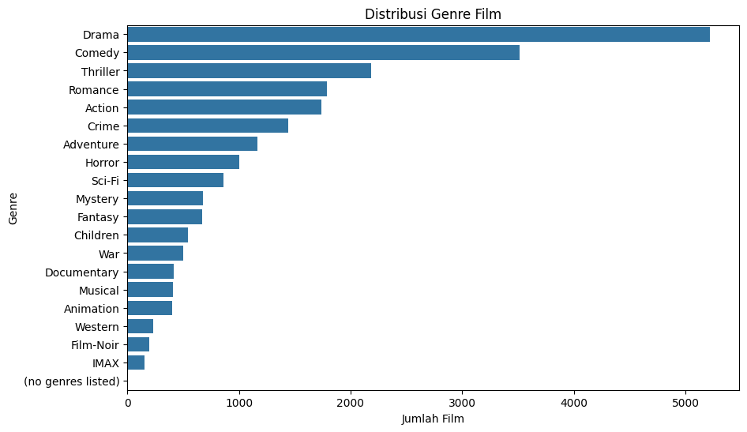
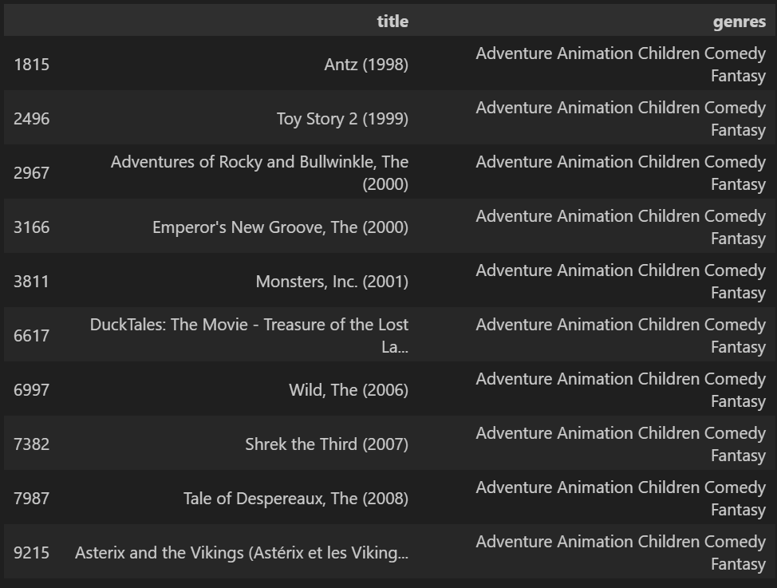
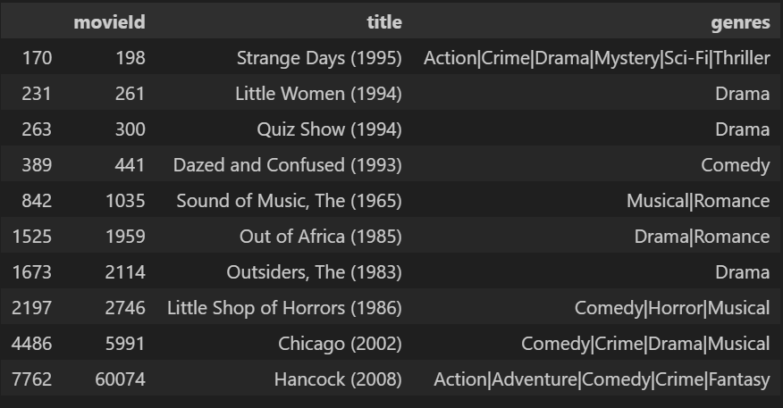

# Laporan Proyek Machine Learning - M. Alwan Fauzi

## Project Overview

Sistem rekomendasi telah menjadi elemen penting dalam platform digital, terutama di industri hiburan seperti layanan streaming film. Dengan semakin banyaknya pilihan film, pengguna sering kali mengalami kesulitan dalam menentukan tontonan yang sesuai dengan preferensi mereka. Oleh karena itu, diperlukan sistem yang mampu memberikan rekomendasi film yang relevan dan personal.

Proyek ini bertujuan membangun sistem rekomendasi film berbasis machine learning menggunakan dua pendekatan utama: Collaborative Filtering (CF) dan Content-Based Filtering (CBF). Dataset yang digunakan bersumber dari Kaggle melalui tautan: MovieLens Dataset by Ayushi Mishra, dengan dua file utama: `movies.csv` dan `ratings.csv`.

Collaborative Filtering (CF) akan dikembangkan dengan pendekatan deep learning, yaitu menggunakan neural network `RecommenderNet` berbasis arsitektur `Model` dari Keras. CF bekerja dengan mempelajari pola interaksi antar pengguna dan item berdasarkan rating historis.

Content-Based Filtering (CBF) akan memanfaatkan metadata dari film, seperti genre, untuk merekomendasikan film yang mirip dengan yang sebelumnya disukai pengguna.

Kedua pendekatan ini akan dievaluasi untuk melihat kelebihan dan kekurangannya dalam memberikan rekomendasi yang personal.

**Referensi:**

[1] J. Ben Schafer, D. Frankowski, J. Herlocker, S. Sen, *Collaborative Filtering Recommender Systems*, in: The Adaptive Web, Springer, 2007.

[2] Ayushi Mishra. *MovieLens Dataset*. [Online]. Tersedia: [https://www.kaggle.com/datasets/ayushimishra2809/movielens-dataset/data](https://www.kaggle.com/datasets/ayushimishra2809/movielens-dataset/data)

## Business Understanding

### Problem Statements

- Bagaimana memberikan rekomendasi film yang relevan kepada pengguna berdasarkan data yang tersedia?
- Bagaimana memanfaatkan metadata film dan interaksi pengguna untuk membangun dua pendekatan rekomendasi yang efektif?
- Sejauh mana pendekatan Content-Based Filtering dan Collaborative Filtering dapat saling melengkapi dalam meningkatkan kualitas rekomendasi?

### Goals

- Membangun sistem rekomendasi film menggunakan dua pendekatan: Content-Based Filtering dan Collaborative Filtering.
- Membandingkan performa dari kedua pendekatan dalam hal akurasi dan relevansi rekomendasi.
- Menyediakan rekomendasi film yang lebih personal dan relevan kepada pengguna berdasarkan preferensi atau perilaku historis mereka.

### Solution Statements

Untuk menjawab permasalahan dan mencapai tujuan proyek, digunakan dua pendekatan solusi:

#### Content-Based Filtering (CBF)

- Menggunakan metadata film (seperti genre) untuk menghitung kemiripan antar film.
- Rekomendasi diberikan berdasarkan kesamaan konten dengan film yang telah disukai oleh pengguna.

#### Collaborative Filtering (CF)

- Menggunakan rating yang diberikan pengguna terhadap film.
- Memanfaatkan model deep learning (`RecommenderNet`) untuk mempelajari representasi laten pengguna dan film dalam ruang vektor, dan memprediksi rating untuk pasangan pengguna-film yang belum pernah terjadi.

## Data Understanding

Dataset yang digunakan dalam proyek ini adalah subset dari **MovieLens Dataset** yang terdiri dari dua file utama:

- **movies.csv**: Berisi informasi mengenai film, seperti `movieId`, `title`, dan `genres`.
- **ratings.csv**: Berisi data interaksi pengguna berupa `userId`, `movieId`, `rating`, dan `timestamp`.

### Insight dari Data Understanding dan EDA

1. **Struktur Dataset**
   - `movies.csv` memiliki **10.329 entri** dan terdiri dari 3 kolom: `movieId`, `title`, dan `genres`.
   - `ratings.csv` memiliki **105.339 entri** dengan 4 kolom: `userId`, `movieId`, `rating`, dan `timestamp`.

2. **Kondisi Data**
   - **Missing Values:**  
     Berdasarkan hasil `.isnull().sum()` pada kedua dataset, **tidak ditemukan missing values** pada kolom manapun. Hal ini memastikan seluruh data dapat langsung digunakan tanpa perlu proses imputasi atau penghapusan baris/kolom.
   - **Duplikasi:**  
     Tidak ditemukan data duplikat pada kedua dataset setelah dilakukan pengecekan. Setiap baris pada `movies.csv` dan `ratings.csv` merepresentasikan entitas unik.
   - **Outlier:**  
     Pada data rating, tidak ditemukan outlier yang mencolok karena seluruh nilai rating berada pada rentang yang valid (0.5 hingga 5.0) sesuai standar MovieLens.

3. **Statistik Deskriptif dari ratings.csv**
   - **Rentang rating:** dari 0.5 hingga 5.0.
   - **Rata-rata rating:** sekitar 3.52, menunjukkan kecenderungan pengguna memberikan penilaian positif terhadap film.
   - **Mayoritas rating** berada di antara 3.0 hingga 4.0, mencerminkan bahwa pengguna cenderung tidak memberikan penilaian ekstrem (terlalu rendah atau terlalu tinggi).

4. **Distribusi Rating Film**
   - 
   - **Insight:**
     - Rating 4.0 adalah yang paling umum diberikan.
     - Jumlah rating menurun signifikan untuk nilai rendah seperti 0.5–2.0, yang menunjukkan pengguna jarang memberikan rating negatif.
     - Kurva KDE menunjukkan distribusi yang miring ke kiri, menandakan kecenderungan optimistik dalam penilaian.

5. **Distribusi Genre Film**
   - 
   - **Insight:**
     - **Drama** adalah genre yang paling banyak muncul, diikuti oleh **Comedy**, **Thriller**, dan **Romance**.
     - Genre seperti **IMAX**, **Film-Noir**, dan **Western** memiliki jumlah film yang relatif sedikit.
     - Keberagaman genre ini menjadi potensi penting untuk Content-Based Filtering, karena bisa dimanfaatkan untuk menghitung kemiripan antar film berdasarkan genre.

## Data Preparation

Pada tahap ini dilakukan beberapa proses persiapan data agar dapat digunakan secara optimal untuk membangun sistem rekomendasi, baik dengan pendekatan Content-Based Filtering (CBF) maupun Collaborative Filtering (CF). Dataset yang digunakan terdiri dari dua file utama:

- **movies.csv**: Berisi informasi mengenai film, seperti `movieId`, `title`, dan `genres`.
- **ratings.csv**: Berisi data interaksi pengguna berupa `userId`, `movieId`, `rating`, dan `timestamp`.

Beberapa tahapan yang dilakukan:

#### a. Memeriksa Missing Values
Kedua dataset telah diperiksa, dan **tidak ditemukan missing values**, sehingga tidak perlu dilakukan imputasi atau penghapusan baris/kolom.

#### b. Mengolah Kolom Genre (CBF)
Pada dataset `movies.csv`, kolom `genres` berisi genre film yang dipisahkan oleh tanda "|". Kolom ini kemudian diproses agar dapat digunakan untuk perhitungan kesamaan antar film.

**Langkah yang dilakukan:**
- Memisahkan genre berdasarkan tanda "|" menjadi list genre.
- Melakukan transformasi teks `genres` menjadi representasi vektor menggunakan `CountVectorizer`.

**Alasan:**  
Genre film merupakan representasi fitur utama untuk pendekatan CBF, sehingga perlu diubah ke format numerik agar bisa dihitung tingkat kesamaannya.

#### c. Menghapus Kolom Timestamp dari ratings.csv
Pada dataset `ratings.csv`, kolom `timestamp` dihapus karena tidak digunakan dalam proses pemodelan maupun analisis lebih lanjut.

- **Langkah:**  
  Menghapus kolom `timestamp` menggunakan `ratings_df.drop('timestamp', axis=1)`.

#### d. Menyiapkan Data untuk Collaborative Filtering (CF)
Untuk CF, digunakan data `ratings.csv` yang sudah dibersihkan. Proses persiapan meliputi:

- **Encoding ID:** Menggunakan `LabelEncoder` untuk mengubah nilai `userId` dan `movieId` menjadi integer yang lebih efisien untuk digunakan dalam model deep learning.
- **Normalisasi Rating:** Rating diformat dalam skala 0.5 - 5.0, dan akan digunakan untuk prediksi skor dalam model CF.
- **Pembagian Dataset:** Dataset dibagi menjadi data train dan test dengan proporsi 80:20 untuk proses pelatihan dan evaluasi.

#### e. Mapping ID ke Nama Film
Agar hasil rekomendasi lebih mudah dipahami, dibuat mapping dictionary antara `movieId` dengan `title` untuk mengubah ID menjadi nama film saat menampilkan hasil rekomendasi.

## Modeling

Pada proyek ini, sistem rekomendasi dibangun dengan dua pendekatan utama untuk menjawab kebutuhan rekomendasi yang relevan dan personal, yaitu Content-Based Filtering (CBF) dan Collaborative Filtering (CF). Kedua pendekatan dikembangkan untuk dibandingkan kelebihan dan kekurangannya.

### 1. Content-Based Filtering (CBF)

Pendekatan CBF merekomendasikan film berdasarkan kemiripan konten, khususnya genre film. Algoritma utama yang digunakan adalah:

- **CountVectorizer:** Untuk mengubah teks genre menjadi representasi vektor numerik (bag-of-words).
- **Cosine Similarity:** Untuk menghitung tingkat kesamaan antar film berdasarkan representasi vektor genre.

**Proses:**
- Genre film diproses menggunakan CountVectorizer sehingga setiap film direpresentasikan sebagai vektor berdasarkan genre-nya.
- Matriks similarity antar film dihitung menggunakan Cosine Similarity.
- Untuk setiap film yang dipilih pengguna, sistem akan mencari film lain yang memiliki tingkat kemiripan tertinggi berdasarkan genre.
- Ditampilkan Top-10 Recommendation untuk setiap input film.

**Contoh Output:**
Jika pengguna menyukai *Toy Story (1995)*, maka sistem dapat merekomendasikan film lain dengan genre serupa seperti *Toy Story 2 (1999)*.

**Kelebihan:**
- Tidak membutuhkan interaksi pengguna.
- Cocok untuk new item recommendation (film baru yang belum pernah dirating pengguna lain).

**Kekurangan:**
- Rekomendasi terbatas pada kesamaan fitur (genre), sehingga kurang mempertimbangkan selera personal pengguna.

---

### 2. Collaborative Filtering (CF)

Pendekatan CF memanfaatkan interaksi pengguna berupa rating yang diberikan terhadap film. Model yang digunakan adalah **RecommenderNet**, arsitektur neural network berbasis Keras.

**Arsitektur Model:**
- Input Layer untuk userId dan movieId, masing-masing dipetakan ke embedding layer untuk membentuk representasi vektor laten.
- Dot Product Layer untuk menghitung kecocokan antara representasi pengguna dan film.
- Output Layer berupa prediksi rating.

**Proses:**
- Melatih model dengan dataset rating yang telah diproses (user dan movie sudah di-encode ke integer).
- Menggunakan model untuk memprediksi rating film yang belum pernah ditonton oleh pengguna.
- Menyajikan Top-10 Recommendation berdasarkan prediksi rating tertinggi.

**Contoh Output:**
Untuk kasus disini user yang digunakan adalah user dengan ID 100, sistem memberikan rekomendasi 10 film dengan prediksi rating tertinggi yang belum pernah ditonton.

**Kelebihan:**
- Mampu memberikan rekomendasi yang lebih personal.
- Mampu menangkap pola kompleks interaksi pengguna dan item.

**Kekurangan:**
- Cold Start Problem: Tidak optimal untuk pengguna baru atau film baru yang belum memiliki rating.

## Evaluation

Pada proyek ini digunakan dua pendekatan sistem rekomendasi, yaitu Content-Based Filtering (CBF) dan Collaborative Filtering (CF). Masing-masing pendekatan memiliki karakteristik dan metode evaluasi yang berbeda sesuai dengan jenis output yang dihasilkan.

### 1. Evaluasi Content-Based Filtering (CBF)

Pendekatan CBF memberikan rekomendasi berdasarkan kemiripan fitur antar film, khususnya genre. Karena CBF tidak memprediksi nilai rating numerik, evaluasi dilakukan secara **kualitatif** dengan meninjau relevansi hasil rekomendasi.

**Contoh Hasil Rekomendasi:**

Film Referensi: **Toy Story (1995)**

| title                                                         | genres                                      |
|---------------------------------------------------------------|---------------------------------------------|
| Antz (1998)                                                   | Adventure Animation Children Comedy Fantasy |
| Toy Story 2 (1999)                                            | Adventure Animation Children Comedy Fantasy |
| Adventures of Rocky and Bullwinkle, The (2000)                | Adventure Animation Children Comedy Fantasy |
| Emperor's New Groove, The (2000)                              | Adventure Animation Children Comedy Fantasy |
| Monsters, Inc. (2001)                                         | Adventure Animation Children Comedy Fantasy |
| DuckTales: The Movie - Treasure of the Lost Lamp (1990)       | Adventure Animation Children Comedy Fantasy |
| Wild, The (2006)                                              | Adventure Animation Children Comedy Fantasy |
| Shrek the Third (2007)                                        | Adventure Animation Children Comedy Fantasy |
| Tale of Despereaux, The (2008)                                | Adventure Animation Children Comedy Fantasy |
| Asterix and the Vikings (Astérix et les Vikings) (2006)       | Adventure Animation Children Comedy Fantasy |

*Gambar: Tabel hasil rekomendasi CBF untuk Toy Story (1995)*

**Insight:**  
Hasil rekomendasi didominasi oleh film-film dengan genre serupa (Animation, Children, Comedy, Fantasy), sehingga relevansi rekomendasi dapat dianggap baik secara subjektif.

**Kelebihan CBF:**
- Tidak bergantung pada rating pengguna.
- Cocok untuk merekomendasikan film baru yang belum memiliki rating.

**Kekurangan CBF:**
- Rekomendasi kurang personal karena hanya mempertimbangkan fitur konten (genre) tanpa mempertimbangkan preferensi unik setiap pengguna.

---

### 2. Evaluasi Collaborative Filtering (CF)

Untuk pendekatan CF dengan RecommenderNet, digunakan **Root Mean Squared Error (RMSE)** sebagai metrik evaluasi. RMSE mengukur seberapa jauh prediksi rating yang dihasilkan model terhadap rating aktual yang diberikan pengguna.
**Formula RMSE:**

**Formula RMSE:**

RMSE = √(1/n ∑(yi - ŷi)²)

- `yi` : nilai rating aktual
- `ŷi` : nilai prediksi rating
- `n` : jumlah sampel  

**Hasil RMSE:**
- RMSE = **1.0097**

**Interpretasi:**  
Nilai RMSE sebesar 1.0097 menandakan bahwa rata-rata kesalahan prediksi rating sekitar 1 poin pada skala rating 0.5 sampai 5.0. Nilai ini menunjukkan performa yang cukup baik untuk model dengan dataset berskala menengah dan arsitektur sederhana.

**Contoh Hasil Rekomendasi Personalized (User ID: 100):**

| movieId | title                                         | genres                                      |
|---------|-----------------------------------------------|---------------------------------------------|
| 48      | Pocahontas (1995)                             | Animation Children Drama Musical Romance     |
| 110     | Braveheart (1995)                             | Action Drama War                            |
| 161     | Crimson Tide (1995)                           | Drama Thriller War                          |
| 318     | Shawshank Redemption, The (1994)              | Crime Drama                                 |
| 356     | Forrest Gump (1994)                           | Comedy Drama Romance War                    |
| 1035    | Sound of Music, The (1965)                    | Musical Romance                             |
| 1287    | Ben-Hur (1959)                                | Action Adventure Drama                      |
| 1380    | Grease (1978)                                 | Comedy Musical Romance                      |
| 3753    | Patriot, The (2000)                           | Action Drama War                            |
| 5618    | Spirited Away (Sen to Chihiro no kamikakushi) | Adventure Animation Fantasy                 |

*Gambar: Tabel hasil rekomendasi CF untuk user ID 100*

**Kelebihan CF:**
- Rekomendasi lebih personal karena mempelajari pola interaksi antar pengguna.
- Dapat memberikan rekomendasi meskipun film tidak memiliki metadata lengkap.

**Kekurangan CF:**
- Rentan terhadap masalah cold-start, baik pada pengguna baru maupun film baru.
- Membutuhkan jumlah data interaksi yang cukup besar agar model bekerja optimal.

---

### 3. Perbandingan CBF dan CF

| Aspek                | Content-Based Filtering (CBF)         | Collaborative Filtering (CF)          |
|----------------------|---------------------------------------|---------------------------------------|
| Basis rekomendasi    | Kemiripan konten (genre)              | Pola perilaku pengguna                |
| Personalisasi        | Rendah                                | Tinggi                                |
| Kelebihan            | Cocok untuk item baru                 | Cocok untuk pengguna aktif            |
| Kekurangan           | Tidak mempertimbangkan preferensi     | Membutuhkan data rating yang memadai  |
| Metrik Evaluasi      | Subjektif (kualitatif)                | RMSE = 1.0273                         |

---

### 4. Kesimpulan Evaluasi

- **CBF** memberikan hasil rekomendasi yang relevan secara konten, namun belum sepenuhnya personal.
- **CF** memiliki performa yang lebih baik dalam memberikan rekomendasi yang sesuai preferensi pengguna, dibuktikan dengan nilai RMSE yang relatif kecil (1.0273).
- Pemilihan metode terbaik dapat disesuaikan dengan kebutuhan: CBF untuk film baru, CF untuk rekomendasi yang lebih personal.

---